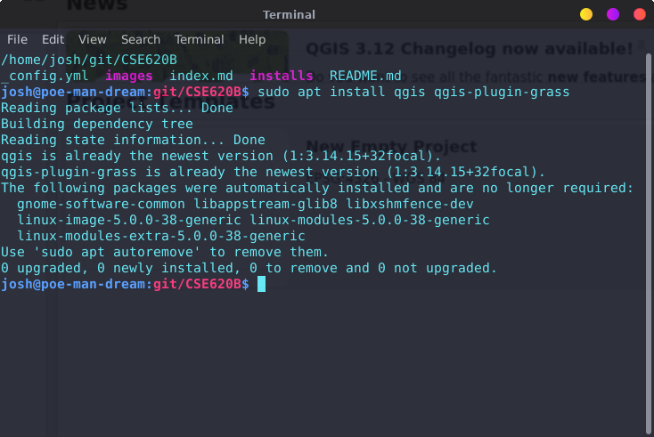
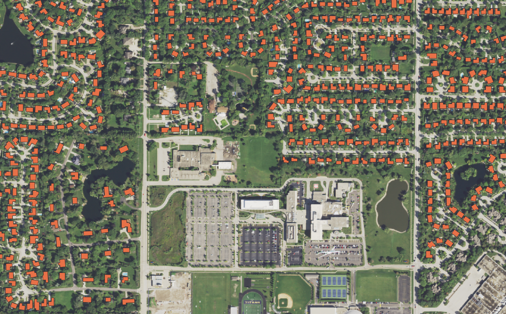

# Installing QGIS

### 1. Install QGIS

I started by installing QGIS



### 2. Find a region in Overpass Turbo

I then ran the following query to find houses around my high school

```
*/
[out:json][timeout:25];
// gather results
(
  // query part for: “house”
  way["building"="house"]({{bbox}});
  relation["building"="house"]({{bbox}});
);
// print results
out body;
>;
out skel qt;
```

### 3. Download High Res Orthoimagery

Downloaded NAIP ID `M_4208750_SW_16_060_20190809`

### 4. Render with orthoimagery and vector data

...and ended up with all houses overlaid on an image of my high school and the surrounding area.


