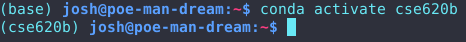
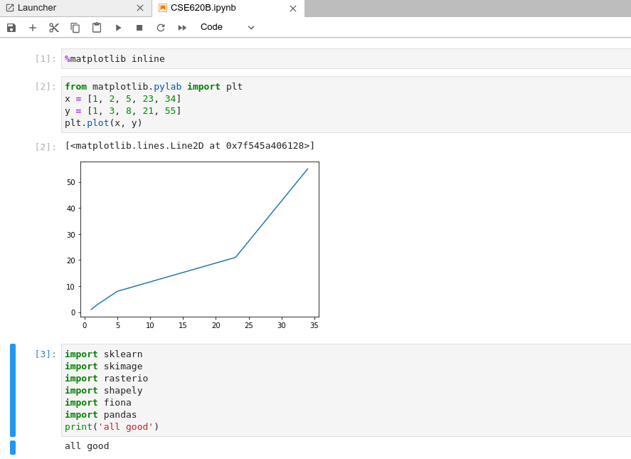

# Anaconda Installation

### 1-2. Install Anaconda

### 3-4. Create an environment for this class and activate it

### 5-6. Install a lot of packages and create an ipython kernel

### 7-14. Open up a new jupyter notebook, make a plot, and validate a lot of installs

