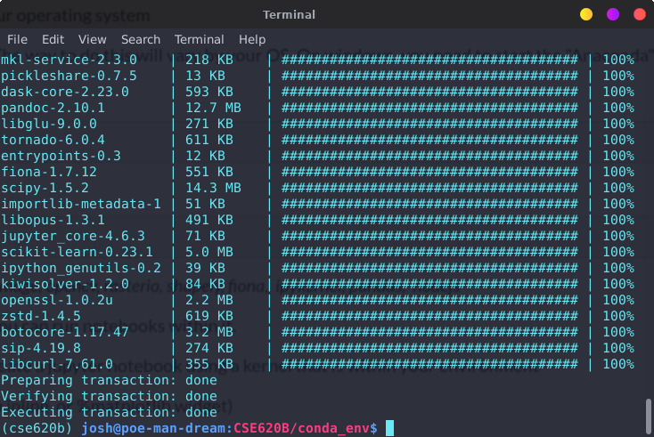
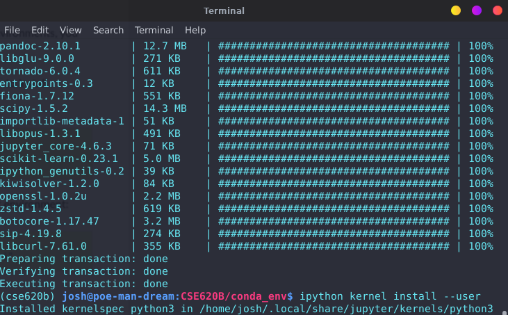

# Anaconda Installation

### 1-2. Install Anaconda

### 3-4. Create an environment for this class and activate it

### 5. Install a lot of packages

### 7. Upen up a new jupyter notebook using the kernel in jupyter lab
